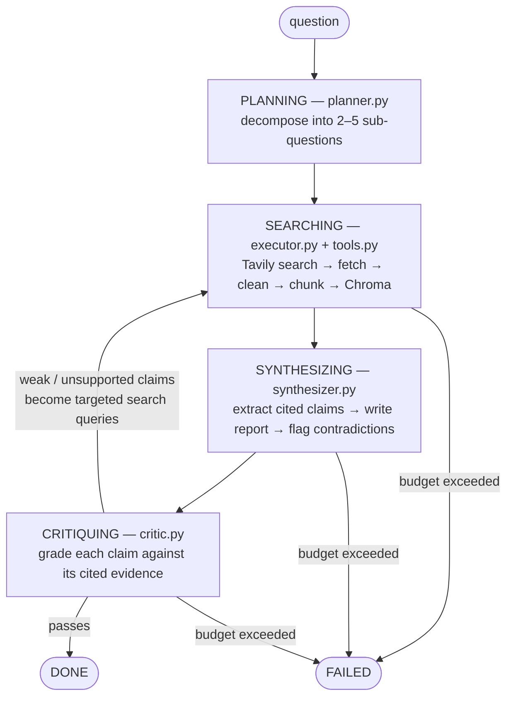

# Shodh (शोध) — Autonomous Research Agent

An autonomous research agent that plans multi-step web research, cross-examines sources, and produces citation-grounded reports — built from scratch, with no agent frameworks.

Given a question, Shodh decomposes it into sub-questions, retrieves and chunks web sources, synthesizes a report where every sentence carries an inline citation, then grades its own draft claim-by-claim and re-searches specifically for the claims that failed. The loop runs until the critique passes or a hard iteration/token budget stops it. A 30-question eval harness quantifies the whole loop against a single-pass RAG baseline with an independent model-graded judge.

## Key features

- **Hand-written agent loop.** No LangChain, LlamaIndex, or CrewAI. The entire orchestration — plan → search → synthesize → critique → re-search — is one readable generator in `api/main.py`, backed by an explicit state machine.
- **State machine with hard guards.** `agent/state.py` enforces a legal-transition table between phases and two ceilings: max 6 loop iterations and a 40k-token context budget, charged at prompt time (when evidence actually enters a Gemini call). Crossing either raises `BudgetExceeded` and lands in `Phase.FAILED` — the agent fails loudly instead of running away.
- **Per-claim self-critique.** The synthesizer must first extract atomic claims with citations, then write the report only from those claims. A separate critic pass grades each claim `supported` / `weakly-supported` / `unsupported` against only the evidence it cites.
- **Gap-driven re-retrieval.** Each failed claim's own text becomes a targeted search query routed back through the executor — not a generic "search again."
- **Contradiction surfacing.** When sources disagree on a fact, the synthesizer records both sides under `contradictions` instead of silently picking one.
- **Independent, honest eval.** The eval judge is deliberately *not* the agent's own critic (the agent optimizes to satisfy its critic, so that would bias the comparison). A separate Gemini judge scores citation support identically for agent and baseline, on a benchmark whose categories were frozen before any question was written — with the 30-question / 5-category shape enforced by `tests/test_benchmark.py`.

## Architecture



| Path | Role |
|---|---|
| `agent/planner.py` | Question → 2–5 independently-searchable sub-questions (one Gemini call) |
| `agent/executor.py` | Per sub-question: search, fetch, chunk, store in Chroma with source metadata |
| `agent/tools.py` | Search (Tavily), fetch + boilerplate-strip (httpx + trafilatura), chunker |
| `agent/synthesizer.py` | Two-stage synthesis: claims with citations first, report written only from them |
| `agent/critic.py` | Per-claim grading; pass/fail gate that drives the re-search loop |
| `agent/state.py` | Phase state machine, iteration/token guards, trace log |
| `agent/json_utils.py` | Deterministic JSON cleanup + one bounded retry for Gemini's structured output |
| `retrieval/store.py`, `retrieval/ranker.py` | Embedded Chroma wrapper; dedupe + distance rerank |
| `api/main.py` | The full orchestration loop, streamed as SSE state snapshots |
| `ui/app.py` | Streamlit client rendering the live agent trace |
| `evals/` | Frozen 30-question benchmark, agent-vs-baseline runner, independent citation judge |

## Results

Full agent loop vs. a single-pass RAG baseline (one search, one fetch round, one synthesis call, no critique) on the frozen 30-question benchmark. One run each, no re-runs, no post-hoc tuning — full tables and methodology in [`evals/results.md`](evals/results.md) and [`evals/README.md`](evals/README.md).

| Metric | Baseline | Agent | Delta |
|---|---|---|---|
| Citation accuracy (model-graded: does cited evidence support the sentence) | 90.0% | 98.9% | +8.9 pp |
| Citation validity (structural: does `[n]` point to a real source) | 76.7% | 83.3% | +6.7 pp |
| Factual precision (expected key facts present in report) | 48.3% | 65.0% | +16.7 pp |

The gains concentrate where multi-step retrieval should matter: factual precision improved +50.0 pp on source-disagreement questions, +33.3 pp on numeric/statistical claims, and +16.7 pp on multi-source synthesis. The agent also lost ground in two places — citation validity on recent-events questions (−33.3 pp) and factual precision on the single-source-trap category (−16.7 pp) — reported as-is, since the eval rules forbid tuning after scoring.

Caveats, honestly: N is 30 (6 per category), so per-category deltas are a handful of questions each; the headline metric is model-graded and therefore non-deterministic; and the benchmark author and agent author are the same person. The mitigations (categories and answers frozen before any run, one external judge applied identically to both sides, benchmark shape enforced in CI) are documented in `evals/README.md`, but this is a self-evaluation, not a third-party one.

## Setup & run

Prerequisites: Python 3.12, a [Gemini API key](https://ai.google.dev/), and a [Tavily API key](https://tavily.com/) (free tiers work).

```bash
python3.12 -m venv .venv && source .venv/bin/activate
pip install -r requirements.txt
cp .env.example .env   # then fill in the two API keys
```

`.env` variables:

| Variable | Required | Purpose |
|---|---|---|
| `GEMINI_API_KEY` | yes | All LLM calls (planner, synthesizer, critic, eval judge) |
| `TAVILY_API_KEY` | yes | Web search |
| `GEMINI_MODEL` | no | Model alias, default `gemini-flash-latest` |
| `SHODH_API_URL` | no | API base URL for the UI, default `http://localhost:8000` |
| `MAX_WEAK_CLAIMS` | no | Critique passes with 0 unsupported and at most this many weak claims (default 2) |

```bash
python scripts/smoke_test.py          # verify both API keys actually work
uvicorn api.main:app --reload         # run the API (port 8000)
streamlit run ui/app.py               # run the demo UI (second terminal)
pytest                                # tests
python -m evals.run_evals --limit 5   # quick eval smoke run
python -m evals.run_evals             # full 30-question benchmark
```

## Tech stack

Python 3.12 · FastAPI (SSE streaming) · Gemini (`google-generativeai`) · Tavily · httpx + trafilatura · Chroma (embedded) · Streamlit · pytest. Single model provider, no auth, no chat history — one question in, one cited report out.

## Limitations & next steps

- **Planner JSON reliability (mostly fixed).** The first full eval run hit malformed JSON on 6 of 30 planner calls — unquoted array elements, a stray `=` after the opening bracket, a nested `[[...]]` wrapper, once an entire response in Hindi. `agent/json_utils.py` now strips what can be stripped deterministically and re-prompts exactly once; a residual bad generation costs one question's score, not the run. The cleaner fix would be Gemini's native structured-output mode (`response_schema`) instead of prompt-and-repair.
- **Sequential fetching.** Sources are fetched one at a time; async fan-out across sub-questions would cut wall-clock time substantially.
- **Simple retrieval.** Character-window chunking and distance-only reranking; `retrieval/ranker.py` is deliberately shaped as the slot where a cross-encoder reranker would go.
- **Eval depth.** With more time: a larger benchmark, repeated runs to measure variance in the model-graded judge, a second question author, and a proper look at why citation validity regressed on recent-events questions.
